# 基于 RAG 与 MCP 的垂直领域智能知识库问答平台

本项目是一个面向私有文档知识库的智能问答平台，围绕文档上传、文档解析、文本切分、向量化检索、RAG 问答、OpenWebUI 接入和 MCP 工具调用构建完整应用闭环。系统支持 mock、OpenAI-compatible API 和 Ollama 三种模型调用模式，并接入 Hugging Face Embedding 与 Chroma 向量数据库，实现可追溯的知识库问答能力。

## 项目定位

项目目标是构建一个可用于垂直领域资料问答的轻量级 RAG 平台。用户可以将岗位要求、技术笔记、项目文档等资料导入知识库，系统将文档切分为 chunk，生成向量并存入本地向量数据库。提问时，系统先检索相关知识片段，再将片段作为上下文交给大模型或 mock 生成器生成回答，并返回引用来源。

项目同时封装了 OpenAI-compatible API，使 OpenWebUI 可以作为统一前端入口调用本项目的 RAG 服务；另外提供 MCP 工具服务，将知识库统计、文件读取、SQLite 笔记查询和知识库检索能力暴露为工具接口。

## 核心能力

- 多类型文档知识库：支持 TXT、Markdown、PDF、Word 等文档接入。
- RAG 问答流程：覆盖文档解析、文本切分、向量化、Top-K 检索、Prompt 组装和答案生成。
- 真实向量检索：支持 Hugging Face `sentence-transformers` embedding 和 Chroma 本地持久化向量数据库。
- 模型调用模式：支持 mock、OpenAI-compatible API、Ollama 本地模型三种模式。
- OpenWebUI 接入：通过 `/v1/models` 和 `/v1/chat/completions` 兼容 OpenAI Chat Completions 接口。
- 知识库管理：支持构建知识库、清空知识库、删除文档、重建指定文档。
- MCP 工具调用：支持知识库统计、项目文件读取、SQLite notes 查询和知识库检索。
- Docker 编排：包含 backend、OpenWebUI、Ollama、MCP Server 等服务定义。

## 技术架构

```text
用户 / OpenWebUI
      |
      v
FastAPI Backend
      |
      +-- Document API
      |     +-- 文档上传
      |     +-- 文档列表
      |     +-- 文档删除
      |
      +-- Knowledge API
      |     +-- 文档解析
      |     +-- 文本切分
      |     +-- Embedding 向量化
      |     +-- Chroma 向量存储
      |
      +-- Chat API
      |     +-- Top-K 检索
      |     +-- Prompt 组装
      |     +-- LLM / Mock / Ollama 生成
      |     +-- sources 引用返回
      |
      +-- OpenAI-compatible API
      |     +-- /v1/models
      |     +-- /v1/chat/completions
      |
      +-- MCP Server
            +-- get_kb_stats
            +-- read_project_file
            +-- query_notes
            +-- search_kb
```

## 模块说明

### FastAPI 后端

后端负责提供项目主要接口，包括文档上传、知识库构建、知识库统计、RAG 问答、OpenAI-compatible 兼容接口等。接口返回中保留 `answer` 和 `sources`，方便用户查看答案依据。

### RAG 检索链路

RAG 链路将用户问题转换为 query embedding，在向量库中进行 Top-K 相似度检索，得到相关 chunk 后拼接为上下文，再交给模型生成回答。返回的 sources 包含 `doc_id`、`filename`、`chunk_id`、`chunk_index`、`score` 和文本片段，提升回答可追溯性。

### Embedding 与 Chroma

项目支持 `sentence-transformers` 真实 embedding 路径，默认可使用中文友好的 BGE 系列模型，也支持多语言 MiniLM 模型作为替代。向量数据通过 Chroma 持久化到本地目录，适合本地开发和小型知识库场景。

### LLM 调用层

模型调用层抽象为统一客户端，当前包含三种模式：

- `mock`：无外部依赖，用于验证完整 RAG 流程。
- `api`：调用 OpenAI-compatible Chat Completions 接口。
- `ollama`：调用本地 Ollama `/api/generate` 接口。

### OpenWebUI 接入

项目提供 OpenAI-compatible API，使 OpenWebUI 可以直接识别模型 `rag-mcp-knowledge-platform`。OpenWebUI 发出的聊天请求会进入项目内部 RAG 流程，而不是直接调用通用大模型。

### MCP 工具服务

MCP 工具服务位于 `mcp_server/`，提供面向智能体工具调用的能力：

- `get_kb_stats`：查询知识库文档数量、chunk 数量、向量库类型和 embedding 模型。
- `read_project_file`：安全读取项目内 Markdown、TXT、JSON 文件。
- `query_notes`：按关键词查询 SQLite notes 表。
- `search_kb`：复用现有向量检索能力查询知识库。

## 项目结构

```text
backend/
  app/
    api/          FastAPI 路由
    core/         配置管理
    db/           SQLite 数据访问
    llm/          mock / api / ollama 模型客户端
    rag/          文档解析、切分、embedding、向量库、RAG Chain

mcp_server/
  server.py       MCP HTTP fallback 服务
  tools.py        MCP 工具函数

scripts/
  build_sample_kb.py
  init_db.py
  test_api.py
  test_mcp_tools.py

tests/
  RAG、Embedding、向量库、知识库 API、MCP 工具测试

data/
  samples/        示例文档
  raw_docs/       上传文档目录占位

resultfig/
  项目运行结果截图
```

## 结果截图

### 项目接口与基础能力

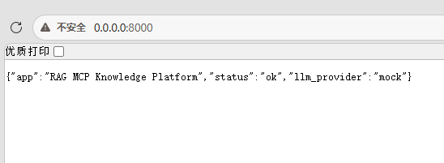

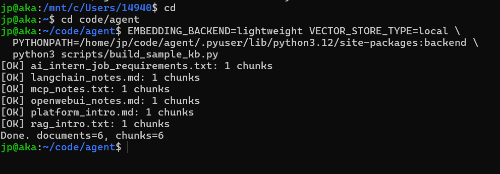

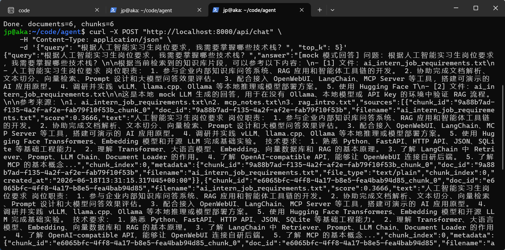

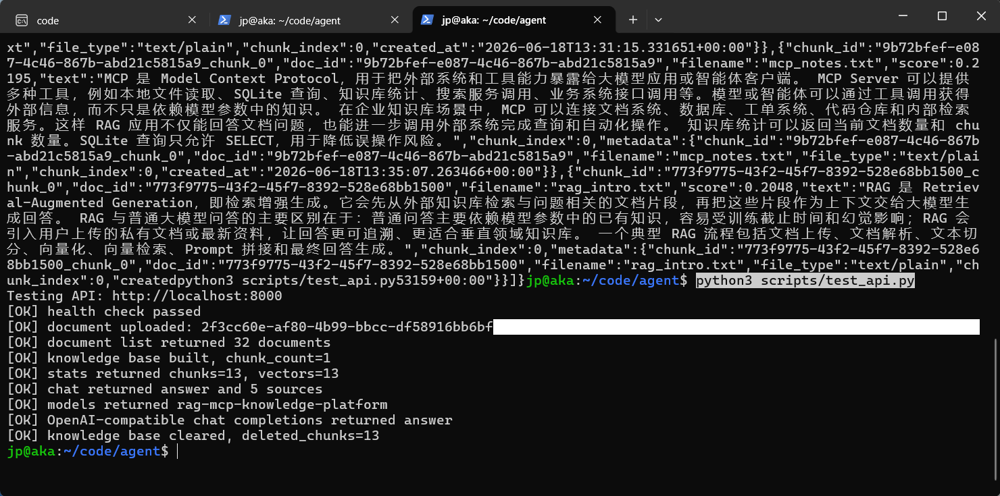

### RAG 问答与 sources 返回

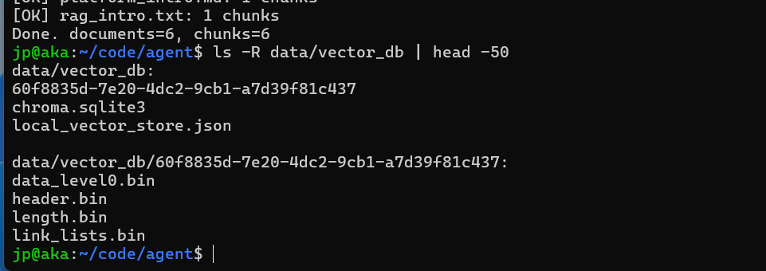

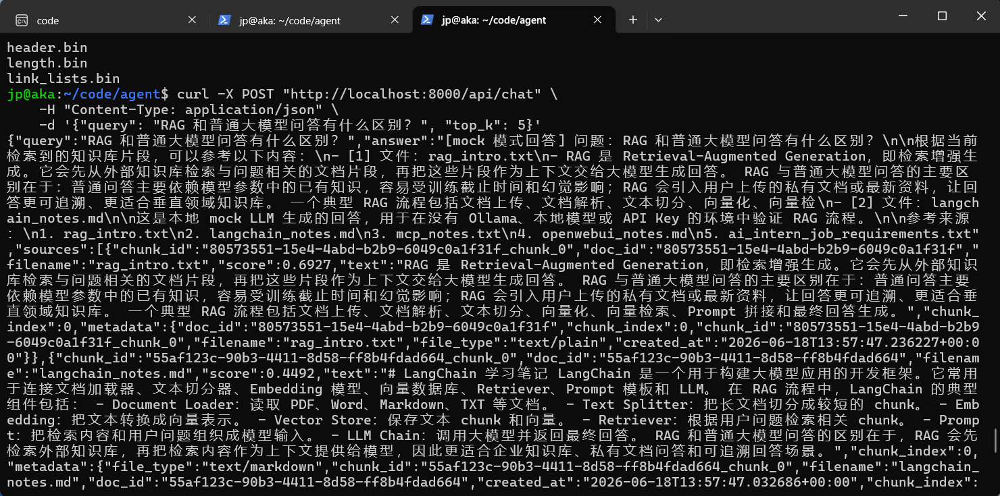

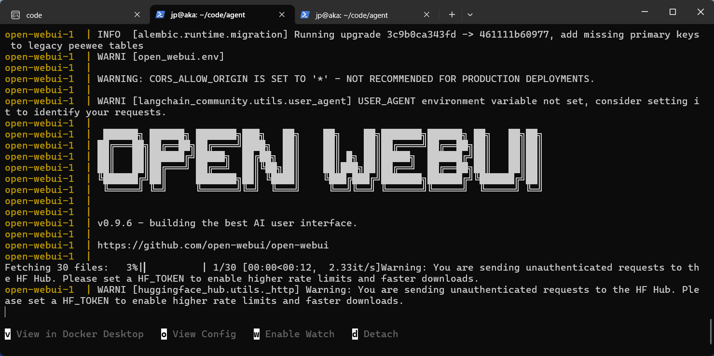

### OpenWebUI 接入效果

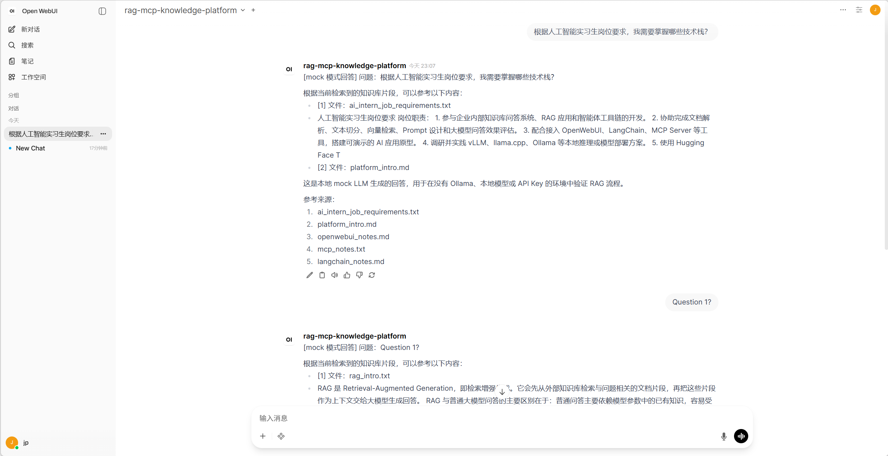

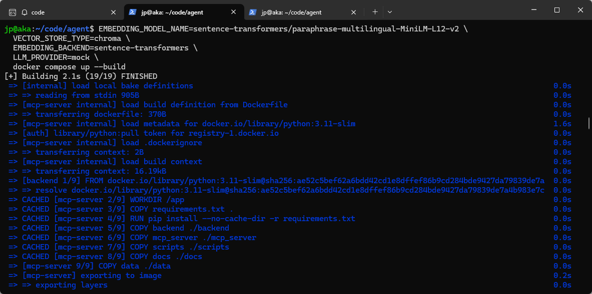

### MCP 工具调用效果

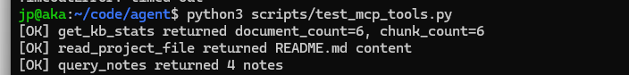

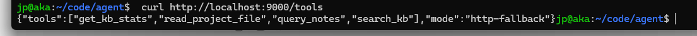

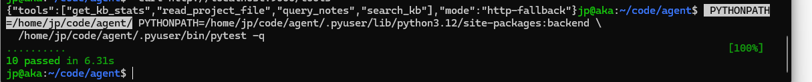

### 自动化验证结果

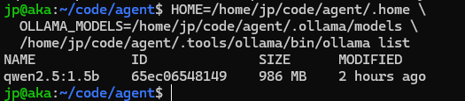

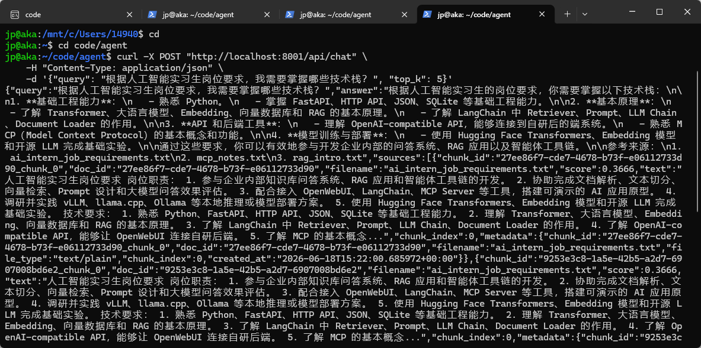

## 项目特点

- 采用 mock-first 设计，先保证完整链路可运行，再切换真实模型能力。
- RAG 检索结果返回结构化 sources，便于定位答案来源。
- OpenWebUI 接入层与内部 RAG 逻辑解耦，前端请求不会绕过知识库检索。
- Embedding、向量库和 LLM 调用均做了配置化抽象，方便替换模型和存储后端。
- MCP 工具复用已有知识库检索能力，避免重复实现检索逻辑。
- 默认保留本地可运行能力，同时支持 Docker Compose 服务编排。

## 当前边界

- Chroma 更适合本地演示和中小规模知识库，大规模生产场景需要引入权限、索引治理和分布式向量数据库。
- mock 模式用于验证流程，不代表真实大模型推理质量。
- Ollama 和 API 模式的回答质量取决于所选模型能力、上下文长度和提示词设计。
- MCP 当前提供 HTTP fallback 工具服务，后续可进一步增强为完整官方 MCP SDK 形态。
